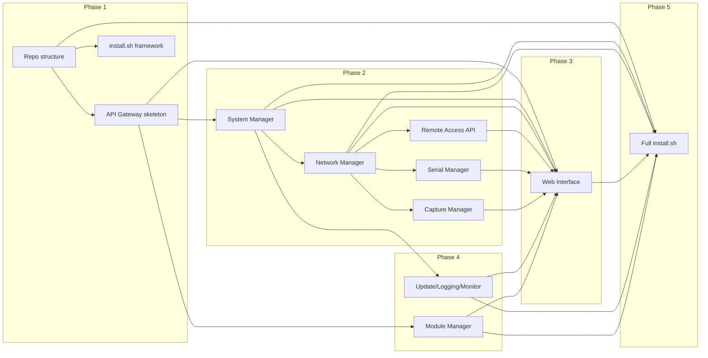

# Full Implementation Plan for RPi Engineer-in-a-Box

This plan is derived from the specification suite in [.planning/](.planning/), the implementation order in [.planning/DEVELOPMENT-GUIDE.md](.planning/DEVELOPMENT-GUIDE.md), and the roadmap in [.planning/README.md](.planning/README.md). **Full implementation is a multi-phase effort with several large, sequential steps**; each phase below is a major milestone.

---

## Scope Summary

| Area             | Spec                                              | Scope                                                                                                                     |
| ---------------- | ------------------------------------------------- | ------------------------------------------------------------------------------------------------------------------------- |
| Foundation       | DEVELOPMENT-GUIDE, SYSTEM-ARCHITECTURE            | Repo layout, API gateway skeleton, install script framework                                                               |
| Backend services | SYSTEM-ARCHITECTURE, API-REFERENCE, feature specs | 8+ services: API Gateway, System, Network, Serial, Capture, Update, Logging, Module Manager; Remote Access integration    |
| Web UI           | WEB-INTERFACE-SPECIFICATION (~2800 lines)         | Simple mode (landing + quick actions), Advanced mode (dashboard + 8+ pages), components, responsive, dark mode, WebSocket |
| Network          | NETWORK-MANAGEMENT-SPECIFICATION (~1000 lines)    | Interface detection, failover, hotspot, VLAN, routing, profiles                                                           |
| Serial           | SERIAL-CONSOLE-SPECIFICATION (~1200 lines)        | Device detection, sessions, WebSocket console, logging, file transfer                                                     |
| Capture          | PACKET-CAPTURE-SPECIFICATION (~1200 lines)        | tcpdump/tshark, BPF, live view, storage, multiple captures                                                                |
| Remote Access    | REMOTE-ACCESS-SPECIFICATION (~900 lines)          | AnyDesk/TeamViewer/VNC install and status/ID APIs                                                                         |
| Modules          | MODULE-SYSTEM-SPECIFICATION (~1150 lines)         | Discovery, lifecycle, API/UI registration, dependencies                                                                   |
| Installation     | INSTALLATION-SPECIFICATION (~1200 lines)          | One-command install, wizard, dependencies, services, verification                                                         |

---

## Phase 1: Foundation (First Large Step)

**Goal**: Repo structure, API gateway skeleton, and install script framework so later work has a single entrypoint and a clear deploy path.

**Deliverables**:

1. **Repository structure** (per [SYSTEM-ARCHITECTURE.md](.planning/SYSTEM-ARCHITECTURE.md) and [DEVELOPMENT-GUIDE.md](.planning/DEVELOPMENT-GUIDE.md))
  - Create: `services/` (api_gateway, network_manager, serial_manager, capture_manager, system_manager, update_manager, module_manager, logging_service, monitor_service), `web/`, `lib/`, `tests/unit/`, `tests/integration/`, `config/`.
  - Add: `requirements.txt`, `requirements-dev.txt`, `.gitignore`, minimal README.
2. **API Gateway skeleton**
  - Flask or FastAPI app; health check (e.g. `GET /api/v1/system/status` or `/health`); CORS.
  - Route layout for all API groups per [SYSTEM-ARCHITECTURE](.planning/SYSTEM-ARCHITECTURE.md) and [API-REFERENCE](.planning/API-REFERENCE.md): `network/`, `serial/`, `capture/`, `system/`, `updates/`, `backup/`, `logs/`, `modules/`, `remote/`. Stub handlers returning mock or 501 as needed.
3. **Installation script framework**
  - Single `install.sh` (or under `bin/`) with: pre-flight checks (OS, arch, disk, network), minimal interactive prompts (e.g. remote access tool, hotspot password), placeholder stages for app install and service setup. No full implementation yet; document behavior in [INSTALLATION-SPECIFICATION](.planning/INSTALLATION-SPECIFICATION.md) where relevant.

**Exit criteria**: `python services/api_gateway/main.py` runs; health check responds; `install.sh` runs and passes pre-flight; directory layout matches architecture.

---

## Phase 2: Core Backend Services (Multiple Large Steps)

**Goal**: Implement the backend services that the web UI and install script will depend on. Order below respects [DEVELOPMENT-GUIDE](.planning/DEVELOPMENT-GUIDE.md) (System first, then Network, then others).

**2a. System Manager**

- Service: system status, resource metrics (CPU, memory, storage, temperature), power (shutdown/reboot), service list/control. Implement logic (e.g. psutil, systemd over D-Bus or subprocess). Expose via API gateway under `system/` per [API-REFERENCE](.planning/API-REFERENCE.md). Replace stubs.

**2b. Network Manager**

- Large step. Per [NETWORK-MANAGEMENT-SPECIFICATION](.planning/NETWORK-MANAGEMENT-SPECIFICATION.md): interface detection (ip/NetworkManager), configuration (DHCP/static), failover (priority/metric), WiFi hotspot (hostapd/dnsmasq), VLANs, routing, profiles (save/load). Expose `network/interfaces`, `network/routes`, `network/profiles`, `network/status`. Integrate with API gateway.

**2c. Remote Access integration**

- Per [REMOTE-ACCESS-SPECIFICATION](.planning/REMOTE-ACCESS-SPECIFICATION.md): no new long-running “manager” process required if install script and systemd handle tool install and startup. Implement `remote/status` and `remote/info` (e.g. read connection IDs from AnyDesk/TeamViewer/VNC config or CLI). Wire into API gateway.

**2d. Serial Manager**

- Large step. Per [SERIAL-CONSOLE-SPECIFICATION](.planning/SERIAL-CONSOLE-SPECIFICATION.md): device detection (pyudev/udev), session management, WebSocket-based console (bidirectional), session logging, optional file transfer. Implement `serial/devices`, `serial/sessions`, WebSocket endpoint for session I/O. Wire into API gateway.

**2e. Capture Manager**

- Large step. Per [PACKET-CAPTURE-SPECIFICATION](.planning/PACKET-CAPTURE-SPECIFICATION.md): start/stop captures (tcpdump/tshark), BPF filters, capture metadata and storage, live stream (e.g. WebSocket or chunked HTTP). Implement `capture/captures`, `capture/stats`, live endpoint. Wire into API gateway.

**Exit criteria**: All core API groups (system, network, serial, capture, remote) implemented and reachable through the gateway; WebSocket endpoints for serial and capture live data working.

---

## Phase 3: Web Interface (Single Very Large Step)

**Goal**: Full dual-mode UI per [WEB-INTERFACE-SPECIFICATION](.planning/WEB-INTERFACE-SPECIFICATION.md).

**3a. Infrastructure and Simple Mode**

- Static assets under `web/` (HTML/CSS/JS). Base layout, theme (including dark mode), responsive/mobile-first. Simple mode: landing page (status card, connection info card, quick actions: Capture, Serial, Logs, Documentation), mode switch to Advanced. Consume System, Network, and Remote APIs for status and connection info.

**3b. Advanced Mode – Shell and Dashboard**

- Shell: sidebar nav (Dashboard, Network, Serial, Capture, System, Updates, Modules, Logs, Documentation), collapsible, mode switch back to Simple. Dashboard: system metrics, network status panel, service status, active captures, recent alerts; all wired to existing APIs.

**3c. Advanced Mode – Feature Pages**

- **Network**: Tabs (Interfaces, VLANs, Routing, Profiles, Hotspot); CRUD and actions per spec.  
- **Serial**: Device list, session create/connect, WebSocket terminal (e.g. xterm.js), log list/export.  
- **Packet Capture**: Start/stop, filter (BPF), interface select, live view, list/download.  
- **System**: Service control, power, basic settings.  
- **Updates & Maintenance**: Check/apply/rollback (calls Update Manager).  
- **Modules**: List, install/uninstall, enable/disable (calls Module Manager).  
- **Logs & Monitoring**: Log viewer, filters, export; metrics/alerts from Monitor/Logging.  
- **Documentation**: Embedded docs (structure per DOCUMENTATION-GUIDELINES).

**3d. Real-time and polish**

- WebSocket clients for serial console, capture live view, and optional status/events. Loading and error states, accessibility (WCAG 2.1 Level A), performance (e.g. &lt;3s load target).

**Exit criteria**: Simple and Advanced modes complete; all spec’d pages and flows implemented; works offline (no CDN); mobile and desktop usable.

---

## Phase 4: Operations Services and Module System (Two Large Steps)

**4a. Update, Logging, and Monitor**

- **Update Manager**: Per UPDATE-MAINTENANCE-SPECIFICATION – check (e.g. git fetch/tag), apply, backup-before-apply, rollback. Expose `updates/check`, `updates/apply`, `updates/rollback`.  
- **Logging Service**: Centralized log aggregation, rotation, API for log viewing/export per LOGGING-MONITORING-SPECIFICATION. Expose `logs/system`, `logs/export`.  
- **Monitor Service**: Metrics collection, health checks, optional alerts. Feed dashboard and status APIs.

**4b. Module Manager**

- Large step. Per [MODULE-SYSTEM-SPECIFICATION](.planning/MODULE-SYSTEM-SPECIFICATION.md): discover modules under `modules/`, load `module.json`, lifecycle (load/unload, enable/disable), API route registration with API gateway, UI component registration for web. Implement `modules/list`, `modules/install`, `modules/uninstall` (and enable/disable if specified). At least one example module to validate the contract.

**Exit criteria**: Updates, logs, and monitoring available via API and UI; module system loads modules and registers routes/UI; example module works.

---

## Phase 5: Installation Script and Deployment (Large Step)

**Goal**: One-command install and post-install verification per [INSTALLATION-SPECIFICATION](.planning/INSTALLATION-SPECIFICATION.md).

- Implement full `install.sh` flow: dependencies (apt/pip), app copy to `/opt/rpi-engineer/` (or target), config generation, systemd units for API gateway and all services, nginx (or chosen server) config, hostapd/dnsmasq for hotspot, remote access tool install and unattended config, optional module install. Interactive wizard (remote tool, hotspot password, hostname, etc.). Post-install verification and reboot prompt. Idempotent and safe to re-run where specified.

**Exit criteria**: On a clean Ubuntu Server 22.04+ or Raspberry Pi OS (Bookworm+) (RPi or compatible), run install command and get a working system (web UI, hotspot, remote access, core features).

---

## Phase 6: Polish and Deployment Prep

- **Testing**: Unit tests for services; integration tests for API and critical flows; system tests on target hardware or VM (see [TESTING-VALIDATION-SPECIFICATION](.planning/TESTING-VALIDATION-SPECIFICATION.md)).  
- **Security**: Harden per [SECURITY-SPECIFICATION](.planning/SECURITY-SPECIFICATION.md) (privilege separation, file permissions, network exposure).  
- **Docs and UX**: Embedded docs up to date; [DOCUMENTATION-GUIDELINES](.planning/DOCUMENTATION-GUIDELINES.md) and [DEPLOYMENT-GUIDE](.planning/DEPLOYMENT-GUIDE.md) followed.  
- **Generalize for GitHub**: Remove project-specific IDs/names (e.g. PRJ28347 → PROJECT1); author “chibashr” per user rules.

---

## Dependency Overview

---

## Risks and Assumptions

- **Hardware-dependent behavior**: Network (hotspot, failover), serial (USB devices), and capture (interfaces) are best validated on real RPi + USB hardware; CI can cover unit/integration tests with mocks.  
- **Install script**: Single large script can become hard to maintain; consider splitting into sourced steps or small scripts while keeping a single entrypoint.  
- **Scope creep**: WEB-INTERFACE-SPECIFICATION and feature specs are detailed; implement in the order above and defer non-critical UI polish to Phase 6.  
- **Assumption**: All specs in `.planning/` are the source of truth; any conflict is resolved in favor of the spec and documented.

---

## Suggested Execution Order

1. Execute **Phase 1** completely (foundation).
2. Execute **Phase 2** in order 2a → 2b → 2c → 2d → 2e, wiring each into the API gateway and testing endpoints before moving on.
3. Execute **Phase 3** in order 3a → 3b → 3c → 3d; parallelize only where a page does not depend on another.
4. Execute **Phase 4a** (Update, Logging, Monitor), then **Phase 4b** (Module Manager).
5. Execute **Phase 5** (full install script) against a clean VM or RPi.
6. Execute **Phase 6** (tests, security, docs, GitHub-ready cleanup).

Each phase is a natural handoff point for review (e.g. Reviewer agent) or testing (Test agent); the Implementer agent should follow the plan and minimal targeted changes per workspace rules.