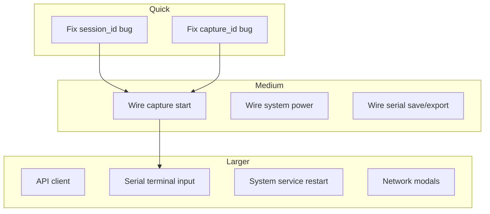

# Implement All Placeholders Plan

## Summary of Placeholders Found

Placeholders fall into five categories:

1. **Empty/stub modules** – `lib/api_client.py` is a single-line docstring
2. **Exception suppression** – bare `pass` in 6 locations (low priority; add logging)
3. **Web UI "coming soon"** – buttons show toasts instead of calling existing backend APIs
4. **Data model mismatches** – frontend uses `id` where API returns `session_id` / `capture_id`
5. **Serial terminal** – display-only; no keyboard input; optional xterm.js upgrade

---

## 1. lib/api_client.py – Internal API Client

**Current state**: Single docstring; no implementation.

**Spec**: Service-to-service HTTP calls (e.g., API Gateway calling other services internally).

**Implementation**:

- Add `get(base_url, path, params=None)`, `post(base_url, path, json=None)`, `put`, `delete`
- Use `requests` (already in [requirements.txt](requirements.txt)) or `urllib.request`
- Base URL from env `RPI_ENGINEER_API_BASE` (default `http://127.0.0.1:5000`)
- Timeout, error handling, JSON serialization
- Keep module minimal; no heavy abstractions

**Reference**: [.planning/API-REFERENCE.md](.planning/API-REFERENCE.md) for base path and response format.

---

## 2. Exception Handling – Replace Pass with Logging

| File                                                                                   | Line | Context                                | Action                            |
| -------------------------------------------------------------------------------------- | ---- | -------------------------------------- | --------------------------------- |
| [services/update_manager/manager.py](services/update_manager/manager.py)               | 145  | Rollback fails during apply_update     | Log warning and re-raise original |
| [services/remote_access_manager/manager.py](services/remote_access_manager/manager.py) | 133  | _primary_ip exception in get_interface | Log debug; continue to fallback   |
| [services/api_gateway/routes/backup.py](services/api_gateway/routes/backup.py)         | 49   | Temp file delete in finally            | Log warning on failure            |
| [services/api_gateway/websockets.py](services/api_gateway/websockets.py)               | 178  | Serial message loop exception          | Log debug; let finally cleanup    |
| [services/system_manager/manager.py](services/system_manager/manager.py)               | 167  | _device_model OSError                  | Keep as-is (intentional fallback) |
| [services/network_manager/manager.py](services/network_manager/manager.py)             | 143  | _interface_names                       | Keep as-is (explicit fallback)    |

Use `logging.getLogger(__name__)`; avoid adding new dependencies.

---

## 3. Web UI – Wire Actions to Backend APIs

Backend APIs exist; frontend shows "coming soon" toasts. Wire each action.

### 3a. System Page ([web/js/pages/system.js](web/js/pages/system.js))

| Button             | Action                   | API                                                                       |
| ------------------ | ------------------------ | ------------------------------------------------------------------------- |
| `restart-selected` | Restart selected service | `POST /api/v1/system/services` with `{service, action: "restart"}`        |
| `restart-system`   | Reboot system            | `POST /api/v1/system/power` with `{action: "reboot"}`                     |
| `shutdown-system`  | Shutdown                 | `POST /api/v1/system/power` with `{action: "shutdown"}`                   |
| `save-settings`    | Hostname/timezone        | Add `PUT /api/v1/system/settings` or extend backend; document if deferred |

**Note**: Service restart requires selection UI; `restart-selected` may need a row-selection pattern. Add `POST /api/v1/system/services` with `{service: name, action: "restart"}`. System power: `RPI_ENGINEER_DRY_RUN=1` skips real poweroff; document behavior.

**Settings**: `PUT /api/v1/system/settings` does not exist. Either add to [services/api_gateway/routes/system.py](services/api_gateway/routes/system.py) and [system_manager](services/system_manager/manager.py) (hostname via `hostnamectl`, timezone via `timedatectl`), or keep as "coming soon" and document.

### 3b. Network Page ([web/js/pages/network.js](web/js/pages/network.js))

| Button                | Action         | API                                                |
| --------------------- | -------------- | -------------------------------------------------- |
| `configure-interface` | Edit interface | Modal/form → `PUT /api/v1/network/interfaces/{id}` |
| `add-vlan`            | Add VLAN       | Not in API; defer or document                      |
| `add-route`           | Add route      | `POST /api/v1/network/routes`                      |
| `save-profile`        | Save profile   | `POST /api/v1/network/profiles`                    |
| `configure-hotspot`   | Hotspot config | Not in API; defer                                  |
| `network-reset`       | Reset network  | Not in API; defer                                  |

Implement: configure-interface (modal), add-route (modal), save-profile (modal). Defer VLAN, hotspot, network-reset per API.

### 3c. Serial Page ([web/js/pages/serial.js](web/js/pages/serial.js))

| Button               | Action           | API                                                         |
| -------------------- | ---------------- | ----------------------------------------------------------- |
| `configure-serial`   | Device config    | Modal → `PUT /api/v1/serial/devices/{id}`                   |
| `serial-save-log`    | Save current log | `GET /api/v1/serial/logs/{id}/content` → trigger download   |
| `export-serial-logs` | Export logs      | `POST /api/v1/serial/logs/export` with `log_ids` → download |

**Fix**: Serial session ID bug (see Section 4).

### 3d. Capture Page ([web/js/pages/capture.js](web/js/pages/capture.js))

| Button          | Action               | API                                                               |
| --------------- | -------------------- | ----------------------------------------------------------------- |
| `new-capture`   | Start capture wizard | Modal with interface, name, filter → `POST /api/v1/capture/start` |
| `start-capture` | Start capture        | Use form values → `POST /api/v1/capture/start`                    |

**Fix**: Capture ID bug (see Section 4).

### 3e. Updates Page ([web/js/pages/updates.js](web/js/pages/updates.js))

| Button           | Action       | API                            |
| ---------------- | ------------ | ------------------------------ |
| `cleanup-wizard` | Data cleanup | No API; keep toast or document |

---

## 4. Data Model Mismatches – session_id vs id, capture_id vs id

### Serial ([web/js/pages/serial.js](web/js/pages/serial.js))

- **API** `list_sessions` returns `{sessions: [{session_id, device_id, ...}]}`.
- **Bug**: `connectWebSocket` uses `activeSessions[0].id`; should use `session_id`.
- **Fix**: Use `session.session_id` in `connectWebSocket` and in `renderSessions` label (e.g. `session.session_id || session.device_id`).

### Capture ([web/js/pages/capture.js](web/js/pages/capture.js))

- **API** `list_active` returns `{captures: [{capture_id, name, ...}]}`.
- **Bug**: `connectLiveView` uses `activeCaptures[0].id`; should use `capture_id`.
- **Fix**: Use `capture.capture_id` in `connectLiveView` and in `renderCaptures` label.

---

## 5. Serial Terminal – Input and Optional xterm.js

**Current state**:

- Display: WebSocket receives `data` and appends to `terminal-placeholder` div.
- Input: None; user cannot type.

**Minimal fix (no xterm.js)**:

- Make terminal div `contenteditable` or add a hidden input field.
- On keypress, send `{type: "data", data: char}` via WebSocket.
- WebSocket client needs `send()`; [web/js/websocket.js](web/js/websocket.js) does not expose it. Add `wsClient.send(message)` or `wsClient.sendData(text)`.

**Optional xterm.js** (per Phase 3d plan):

- Add xterm.js locally (no CDN).
- Replace div with xterm container.
- Attach terminal to WebSocket; `onData` → `send({type: "data", data})`.
- Update [web/advanced/serial.html](web/advanced/serial.html) placeholder text.

**Recommendation**: Implement minimal fix first (contenteditable + send). xterm.js can be a follow-up.

---

## 6. Execution Order

---

## Implementation Order

1. **Phase A – Bug fixes**
  - Fix `session_id` in serial.js
  - Fix `capture_id` in capture.js
2. **Phase B – API client**
  - Implement `lib/api_client.py`
3. **Phase C – Exception logging**
  - Replace `pass` with logging in update_manager, backup, websockets, remote_access_manager
4. **Phase D – Web UI wiring**
  - Capture: start capture (form + wizard)
  - System: power actions (reboot, shutdown)
  - System: service restart (with selection)
  - Serial: save log, export logs
  - Network: add route, save profile, configure interface (modals)
5. **Phase E – Serial terminal input**
  - Add `send()` to WebSocket client
  - Add keyboard input to capture page
  - Add keyboard input to serial page (contenteditable or input)
6. **Phase F – Optional**
  - Settings API (hostname, timezone)
  - xterm.js for serial terminal
  - Deferred: VLAN, hotspot, network reset, cleanup wizard

---

## Risks and Assumptions

- **RPI_ENGINEER_DRY_RUN**: Power and network changes may be no-ops in dev; document behavior.
- **xterm.js**: Adds ~200KB; verify license compatibility.
- **Selection UI**: Service restart needs a way to select which service; may require table row selection.
- **Permissions**: Hostname/timezone changes require root; document.

---

## Files to Modify

| File                                        | Changes                                      |
| ------------------------------------------- | -------------------------------------------- |
| `lib/api_client.py`                         | Full implementation                          |
| `services/update_manager/manager.py`        | Log rollback exception                       |
| `services/remote_access_manager/manager.py` | Log _primary_ip exception                    |
| `services/api_gateway/routes/backup.py`     | Log temp delete failure                      |
| `services/api_gateway/websockets.py`        | Log serial loop exception                    |
| `web/js/pages/serial.js`                    | session_id, save/export, terminal input      |
| `web/js/pages/capture.js`                   | capture_id, start capture                    |
| `web/js/pages/system.js`                    | Power, service restart                       |
| `web/js/pages/network.js`                   | Add route, save profile, configure interface |
| `web/js/websocket.js`                       | Add send()                                   |
| `web/advanced/serial.html`                  | Update placeholder text                      |

---

## Optional / Deferred

- System settings API (hostname, timezone)
- VLAN, hotspot, network reset APIs
- Data cleanup wizard API
- xterm.js for serial terminal

